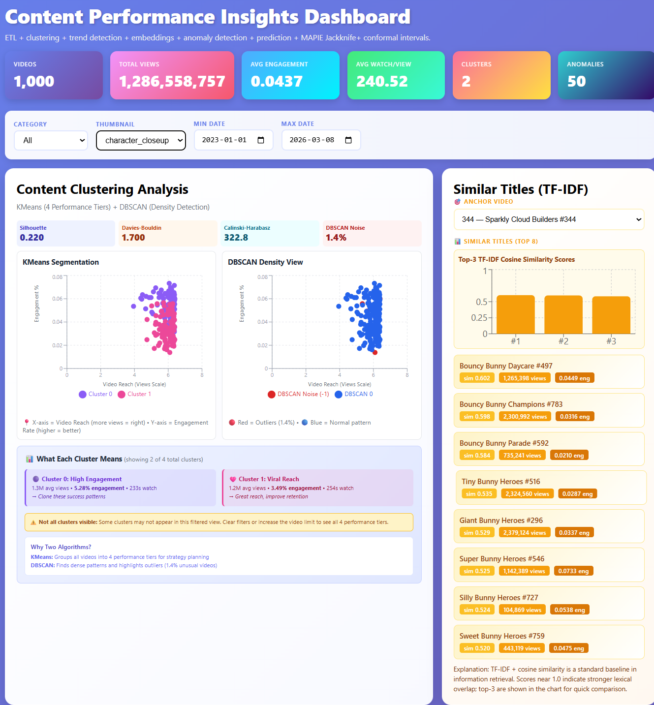
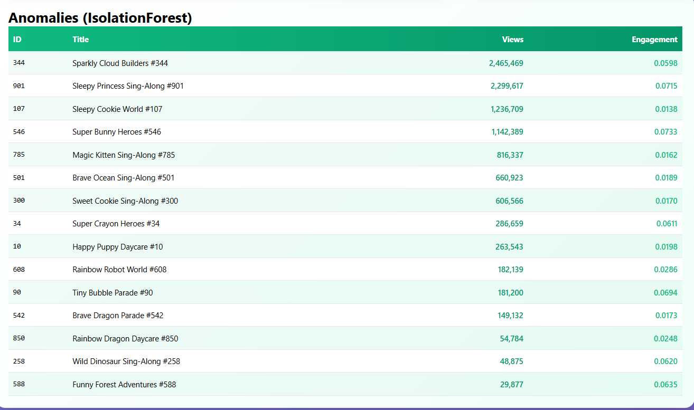
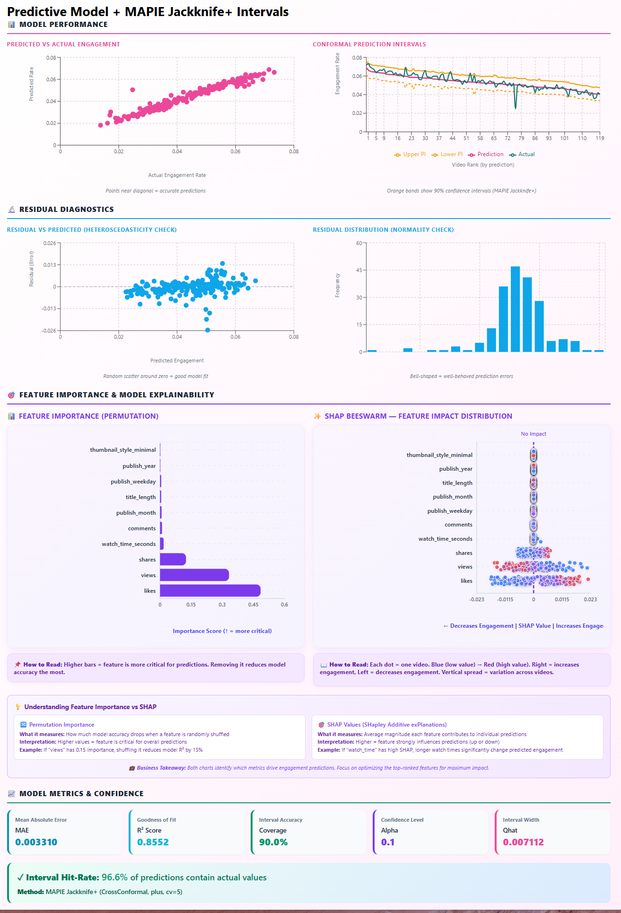

# Blenda Test Data Analytics Full Stack Solution

A full-stack analytics platform for short-form video performance analysis, combining ML-powered insights with interactive visualizations.

## Tech Stack


## 🚀 Quick Start (3 Commands)

```bash
# 1. Build and start all services (backend + frontend)
docker compose up --build -d && sleep 30

# 2. Open dashboard in browser
open http://localhost:5173              # macOS
# OR: xdg-open http://localhost:5173    # Linux
# OR: visit http://localhost:5173       # Windows

# 3. Verify API health
curl http://localhost:8000/health       # Should return: {"status":"healthy"}

# Cleanup when done
docker compose down -v
```

**For complete testing guide (local environment, MLflow, production Docker, git push), see [Quick Start - Local Testing Guide](#-quick-start---local-testing-guide) below.**

---

## Features

### Analytics & ML
- **Clustering Analysis**: K-Means + PCA for content segmentation
- **Similarity Search**: TF-IDF and vector embeddings for content recommendations
- **Trend Detection**: Time series analysis for performance patterns
- **Predictive Models**: MAPIE conformal prediction with SHAP explainability
- **Anomaly Detection**: Isolation Forest for outlier identification

### Data Engineering
- **ETL Pipeline**: Robust data ingestion with validation and feature engineering
- **Schema Design**: Type-safe data models with Pydantic
- **API Integration**: RESTful endpoints with FastAPI

### Full-Stack Implementation
- **Backend**: Python + FastAPI for API services
- **Frontend**: React + TypeScript + Vite for interactive dashboards
- **Visualization**: Recharts for charts and scatter plots

### Infrastructure
- **Database**: PostgreSQL backend for MLflow experiment tracking (production)
- **MLOps**: MLflow tracking integrated for training and inference metrics
- **Containerization**: Docker Compose for multi-service orchestration
- **DevOps**: CI/CD with GitHub Actions, pre-commit hooks, automated testing

---

## Production Infrastructure

### DevOps & Automation
- **CI/CD Pipeline**: `.github/workflows/ci.yml` - Automated testing and build validation
- **Pre-commit Hooks**: `.pre-commit-config.yaml` + `Makefile` - Code quality gates (black, isort, flake8, pytest)
- **Docker Orchestration**: `docker-compose.yml` (dev), `docker-compose.prod.yml` (production with MLflow + PostgreSQL)
- **Kubernetes Ready**: `k8s-deployment.yaml` - Production orchestration template
- **Environment Management**: `.env.development`, `.env.production` - Separate configs for dev/prod

### MLOps & Experiment Tracking
- **MLflow Integration**: Tracks training metrics, model parameters, and inference performance
- **Training Tracking**: `scripts/train_pipeline.py` logs parameters (n_estimators, features), metrics (MSE, R², feature importances), and model artifacts
- **Inference Tracking**: `backend/app/analysis_predictive.py` logs prediction metrics (MAE, R², coverage, interval widths) and SHAP availability
- **Production Setup**: PostgreSQL backend for MLflow metadata storage in `docker-compose.prod.yml`
- **Graceful Degradation**: Works without MLflow if not configured (development mode)

#### MLflow Dashboard

**Access MLflow Tracking UI:**

```bash
# Option 1: Local Development (file-based tracking)
# Start MLflow UI server pointing to local mlruns/ directory
MLFLOW_TRACKING_URI=file:./mlruns mlflow ui --port 5000

# Open browser: http://localhost:5000
# View: Experiments, runs, parameters, metrics, artifacts

# Option 2: Production Docker Stack
docker compose -f docker-compose.prod.yml up -d
# MLflow UI: http://localhost:5000
# Backend API: http://localhost:8000
```

**MLflow Dashboard Features:**
- **Experiments**: `content-insights-training` (model training), `content-insights-inference` (API predictions)
- **Run Comparison**: Compare model versions, hyperparameters, and metrics across training runs
- **Model Registry**: Browse logged RandomForest and KMeans models with version history
- **Artifacts**: Download feature_columns.json, model_manifest.json, and trained models
- **Metrics Visualization**: Line charts for MSE, R², feature importances over time

### Testing & Quality
- **Automated Testing**: `backend/tests/` with pytest, 5 test suites covering ETL, API, and pipelines
- **Linting**: flake8, black, isort for code consistency
- **Type Safety**: mypy for Python, TypeScript strict mode for frontend

### Monitoring & Documentation
- **Health Checks**: `/health` endpoint, Docker healthcheck configurations
- **Documentation**: Comprehensive guides in [`docs/`](docs/) folder (see [Documentation](#-documentation) section below)

### Model Management
- **Version Control**: `models/manifest.json` tracks model versions
- **Training Pipeline**: `scripts/train_pipeline.py` for retraining workflows
- **Artifact Storage**: Joblib-serialized models with version metadata

---

## System Architecture

### High-Level Architecture Diagram

```mermaid
graph TB
    subgraph "Frontend Layer"
        UI[React Dashboard<br/>TypeScript + Vite<br/>Port 3000]
        UI_COMPONENTS[Components:<br/>- Overview Panel<br/>- Clustering Scatter<br/>- Anomalies Table<br/>- Predictive Panel<br/>- Similar Videos Panel]
    end

    subgraph "API Layer"
        API[FastAPI Backend<br/>Python 3.12<br/>Port 8000]
        HEALTH[/health endpoint]
        METRICS[/metrics endpoint]
        CLUSTERING[/clustering endpoint]
        ANOMALY[/anomalies endpoint]
        PREDICTIVE[/predictive endpoint]
        TRENDS[/trends endpoint]
        SIMILAR[/similar endpoint]
    end

    subgraph "Data Processing Layer"
        ETL[ETL Pipeline<br/>etl.py]
        FEATURE[Feature Engineering<br/>feature_utils.py]
        VALIDATION[Data Validation<br/>Pydantic Models]
    end

    subgraph "Analytics Engine"
        CLUSTER_ENGINE[Clustering Analysis<br/>K-Means + PCA<br/>analysis_clustering.py]
        ANOMALY_ENGINE[Anomaly Detection<br/>Isolation Forest<br/>analysis_anomaly.py]
        PREDICTIVE_ENGINE[Predictive Models<br/>MAPIE + SHAP<br/>analysis_predictive.py]
        TRENDS_ENGINE[Trend Analysis<br/>Time Series<br/>analysis_trends.py]
        EMBEDDING_ENGINE[Similarity Search<br/>TF-IDF + Embeddings<br/>analysis_embeddings.py]
    end

    subgraph "ML Model Registry"
        MODELS[Model Artifacts<br/>models/ directory]
        CLUSTERS_MODEL[clusters_v2.joblib<br/>K-Means model]
        PREDICTIVE_MODEL[predictive_mapie.joblib<br/>94MB MAPIE model]
        TFIDF_MODEL[title_tfidf.joblib<br/>2MB vectorizer]
        EMBEDDINGS_MODEL[title_embeddings.joblib<br/>1.5MB vectors]
        SHAP_MODEL[shap_sample.joblib<br/>55KB explainer]
        MANIFEST[manifest.json<br/>Version tracking]
    end

    subgraph "Data Sources"
        CSV[sample_videos.csv<br/>98KB input data<br/>~180 videos]
    end

    subgraph "Infrastructure"
        DOCKER[Docker Compose<br/>Multi-container orchestration]
        CI[GitHub Actions<br/>CI/CD Pipeline]
        PRECOMMIT[Pre-commit Hooks<br/>Code quality gates]
    end

    %% Data Flow
    CSV --> ETL
    ETL --> VALIDATION
    VALIDATION --> FEATURE
    FEATURE --> CLUSTER_ENGINE
    FEATURE --> ANOMALY_ENGINE
    FEATURE --> PREDICTIVE_ENGINE
    FEATURE --> TRENDS_ENGINE
    FEATURE --> EMBEDDING_ENGINE

    %% Model Loading
    MODELS --> CLUSTER_ENGINE
    CLUSTERS_MODEL --> CLUSTER_ENGINE
    PREDICTIVE_MODEL --> PREDICTIVE_ENGINE
    SHAP_MODEL --> PREDICTIVE_ENGINE
    TFIDF_MODEL --> EMBEDDING_ENGINE
    EMBEDDINGS_MODEL --> EMBEDDING_ENGINE
    MANIFEST --> MODELS

    %% API Routing
    CLUSTER_ENGINE --> CLUSTERING
    ANOMALY_ENGINE --> ANOMALY
    PREDICTIVE_ENGINE --> PREDICTIVE
    TRENDS_ENGINE --> TRENDS
    EMBEDDING_ENGINE --> SIMILAR

    %% API Gateway
    CLUSTERING --> API
    ANOMALY --> API
    PREDICTIVE --> API
    TRENDS --> API
    SIMILAR --> API
    HEALTH --> API
    METRICS --> API

    %% Frontend Communication
    API -->|REST API<br/>JSON responses| UI
    UI --> UI_COMPONENTS

    %% Infrastructure
    DOCKER -.->|Containerizes| API
    DOCKER -.->|Containerizes| UI
    CI -.->|Validates| API
    PRECOMMIT -.->|Quality checks| API

    style UI fill:#4FC3F7,stroke:#0277BD,stroke-width:2px
    style API fill:#66BB6A,stroke:#2E7D32,stroke-width:2px
    style PREDICTIVE_ENGINE fill:#FFA726,stroke:#EF6C00,stroke-width:2px
    style MODELS fill:#AB47BC,stroke:#6A1B9A,stroke-width:2px
    style CSV fill:#FFEB3B,stroke:#F57F17,stroke-width:2px
```

### Component Details

| Layer | Component | Technology | Purpose |
|-------|-----------|------------|---------|
| **Frontend** | React Dashboard | TypeScript, Vite, Recharts | Interactive data visualization |
| **API** | FastAPI Backend | Python 3.12, Uvicorn | RESTful API endpoints |
| **ETL** | Data Pipeline | Pandas, Pydantic | Data ingestion & validation |
| **Analytics** | Clustering | K-Means, PCA, scikit-learn | Content segmentation |
| **Analytics** | Anomaly Detection | Isolation Forest | Outlier identification |
| **Analytics** | Predictive Models | MAPIE, SHAP, XGBoost | Performance forecasting with uncertainty |
| **Analytics** | Trend Analysis | Time series analysis | Temporal pattern detection |
| **Analytics** | Similarity Search | TF-IDF, Embeddings | Content recommendation |
| **Storage** | Model Registry | Joblib artifacts | Versioned ML models |
| **Infrastructure** | Docker | docker-compose.yml | Container orchestration |
| **DevOps** | CI/CD | GitHub Actions | Automated testing & deployment |

### Data Flow Architecture

```
┌─────────────┐
│ Raw CSV Data│
│ 180 videos  │
└──────┬──────┘
       │
       ▼
┌─────────────────┐
│  ETL Pipeline   │ ◄── Validation, Cleaning, Type Conversion
└──────┬──────────┘
       │
       ▼
┌─────────────────────────┐
│  Feature Engineering    │ ◄── Derived metrics, Normalization
└──────┬──────────────────┘
       │
       ├────────────────────┐
       │                    │
       ▼                    ▼
┌─────────────┐      ┌─────────────────┐
│  ML Models  │      │  Analytics APIs │
│ (Pre-trained)│      │  (5 endpoints)  │
└──────┬──────┘      └────────┬────────┘
       │                      │
       └──────────┬───────────┘
                  │
                  ▼
          ┌───────────────┐
          │  JSON Results │ ◄── Frontend Visualization
          └───────────────┘
```

### Key Architectural Decisions

1. **Stateless API Design**: All analytics computed on-demand from CSV data
2. **Pre-trained Models**: Models loaded at startup, versioned via manifest.json
3. **Containerized Deployment**: Backend + Frontend in separate Docker containers
4. **RESTful Interface**: Standard HTTP/JSON for frontend-backend communication
5. **Client-side Rendering**: React SPA with dynamic data fetching

---

## 🚀 Quick Start - Local Testing Guide

**IMPORTANT**: Follow this complete testing workflow to verify all functionality.

### Prerequisites

- Docker 20.10+ and Docker Compose v2+ installed
- Python 3.11+ (for local testing)
- Git initialized repository
- 8GB RAM minimum for Docker services

### Step-by-Step Testing Guide

#### **Step 1: Verify Environment**

```bash
# Navigate to project root
cd test_blenda_takehome

# Check Docker availability
docker --version                    # Should show 20.10+
docker compose version              # Should show v2.x (note: no hyphen)

# Verify project files
ls -la                              # Should see: main.py, docker-compose.yml, README.md
ls models/*.joblib | wc -l          # Should show 10+ model files
```

#### **Step 2: Run Pre-Commit Quality Checks**

```bash
# Install quality tools (one-time setup)
make quality-tools

# Install pre-commit hooks
make precommit-install

# Run comprehensive pre-push validation
# This runs: linting, tests, notebook validation, Docker smoke checks
make prepush
```

**Expected Output**:
```
✓ flake8 checks: 0 fatal errors
✓ black formatting: OK
✓ isort imports: OK
✓ mypy types: checked (warnings OK)
✓ pytest: 5/5 tests passed
✓ notebook validation: executed successfully
✓ docker smoke tests: backend + frontend healthy
═══════════════════════════════════════════════
Pre-push quality gate passed.
```

#### **Step 3: Docker Full Stack Test (Recommended)**

This is the **primary validation method** - tests the complete application stack.

```bash
# Clean any existing containers
docker compose down -v

# Build and start services (detached mode)
docker compose up --build -d

# Wait 30 seconds for services to initialize
sleep 30

# Check service status
docker compose ps                   # Both backend/frontend should be "running"

# View logs for troubleshooting
docker compose logs backend | tail -20
docker compose logs frontend | tail -20

# Test backend health endpoint
curl http://localhost:8000/health
# Expected: {"status":"healthy"}

# Test backend metrics (verifies models loaded)
curl http://localhost:8000/metrics | jq .model_version
# Expected: "v2" or similar version string

# Test backend API docs (open in browser or curl)
curl -I http://localhost:8000/docs
# Expected: HTTP/1.1 200 OK

# Test frontend (open in browser)
curl -I http://localhost:5173
# Expected: HTTP/1.1 200 OK

# Run backend tests inside container
docker compose exec backend pytest tests/ -v
# Expected: 5 passed

# **Open browser and verify dashboard**
# Visit: http://localhost:5173
# Should see: KPI cards, cluster scatter, anomaly table, predictive panel
```

#### **Step 4: Test Frontend Interactivity** (Browser)

Open http://localhost:5173 and verify:

1. **Overview Panel**: KPI cards show metrics (avg engagement, total views, etc.)
2. **Filters Bar**: Category/thumbnail dropdowns work, date range updates data
3. **Cluster Scatter**: Points are colored by cluster, hover shows video details
4. **Anomaly Table**: Shows videos with anomaly scores, sortable columns
5. **Similar Content**: Select a video, see top-5 similar recommendations
6. **Predictive Panel**:
   - Model metrics visible (R², MAE, etc.)
   - Predicted vs Actual scatter plot
   - MAPIE confidence intervals chart
   - SHAP beeswarm plot
   - Feature importance bar chart

#### **Step 5: Cleanup Docker Test**

```bash
# Stop and remove all containers
docker compose down -v

# (Optional) Remove built images to free space
docker rmi test_blenda_takehome-backend test_blenda_takehome-frontend
```

#### **Step 6: Local Python Test** (Optional - for debugging)

Only needed if Docker tests fail or you want to debug specific issues.

```bash
# 1. Create and activate virtual environment
./setup_venv.sh
source .venv/bin/activate

# 2. Install all dependencies (including MLflow)
pip install -r requirements.txt
pip install -e backend/

# 3. Verify installation
python --version                    # Should be 3.11+
pip list | grep mlflow              # Should show mlflow 2.10+

# 4. Run training pipeline with MLflow tracking
MLFLOW_TRACKING_URI=file:./mlruns python -m scripts.train_pipeline
# Expected output: "✓ MLflow tracking complete. Run ID: <uuid>"

# 5. Start MLflow UI to view training metrics
mlflow ui --port 5000 &
# Open browser: http://localhost:5000
# You should see "content-insights-training" experiment with logged runs

# 6. Run backend tests locally
cd backend && pytest tests/ -v && cd ..
# Expected: 5 passed

# 7. Start backend API with MLflow inference tracking
export APP_DATA_PATH=./sample_videos.csv
export MLFLOW_TRACKING_URI=file:./mlruns
cd backend && uvicorn app.main:app --reload --port 8000 &
cd ..

# 8. Test API endpoints
curl http://localhost:8000/health
curl http://localhost:8000/insights | jq '.predictive_model.metrics'
# Check MLflow UI - you should see new run in "content-insights-inference" experiment

# 9. (Optional) Start frontend
cd frontend && npm install && npm run dev &
cd ..

# Visit http://localhost:5173 in browser

# 10. Cleanup: kill processes when done
pkill -f mlflow
pkill -f uvicorn
pkill -f vite
deactivate
```

#### **Step 7: Production Docker Compose Test** (Optional)

Tests production configuration with PostgreSQL + MLflow tracking server.

```bash
# 1. Stop development stack if running
docker compose down -v

# 2. Start production stack (PostgreSQL + MLflow + Backend + Frontend)
docker compose -f docker-compose.prod.yml up --build -d

# 3. Wait for services to initialize (60 seconds)
sleep 60

# 4. Verify all services are healthy
docker compose -f docker-compose.prod.yml ps
# Expected: All 4 services showing "running" status
#   - mlflow-database (PostgreSQL)
#   - mlflow-tracking (MLflow server)
#   - content-insights-api (Backend)
#   - content-insights-ui (Frontend)

# 5. Check service logs
docker compose -f docker-compose.prod.yml logs mlflow-tracking | tail -20
docker compose -f docker-compose.prod.yml logs backend | grep -i mlflow

# 6. Test endpoints
curl http://localhost:8000/health    # Backend API
curl -I http://localhost:80          # Frontend (production uses port 80)
curl -I http://localhost:5000        # MLflow UI Dashboard

# 7. Open MLflow Dashboard in browser
# Visit: http://localhost:5000
# You should see experiments stored in PostgreSQL backend

# 8. Trigger inference to log MLflow run
curl http://localhost:8000/insights | jq '.predictive_model.metrics'
# Check MLflow UI - new run should appear in "content-insights-inference"

# 9. Inspect PostgreSQL database (optional)
docker compose -f docker-compose.prod.yml exec mlflow-db psql -U mlflow_user -d mlflow_db -c "\dt"
# Shows MLflow metadata tables

# 10. Cleanup
docker compose -f docker-compose.prod.yml down -v
# Use -v flag to remove volumes (PostgreSQL data)
```

**Production Stack Architecture:**
```
mlflow-database (PostgreSQL:5432)  ←─── MLflow metadata storage
        │
        ├──→ mlflow-tracking (MLflow:5000) ←─── UI Dashboard
                    │
                    └──→ content-insights-api (Backend:8000)
                                │
                                └──→ content-insights-ui (Frontend:80)
```

#### **Step 8: Git Commit and Push to GitHub**

After all tests pass, commit and push your changes.

```bash
# 1. Check current git status
git status
# You should see modified files: requirements.txt, README.md, backend files, etc.
# Untracked files: .env.development, .env.production, .env.example, ENVIRONMENT_BEST_PRACTICES.md

# 2. Add all relevant files
git add requirements.txt
git add backend/pyproject.toml backend/app/analysis_predictive.py backend/app/settings.py
git add scripts/train_pipeline.py
git add README.md ENVIRONMENT_BEST_PRACTICES.md
git add .env.development .env.production .env.example
git add docker-compose.yml docker-compose.prod.yml

# 3. Check what will be committed
git diff --cached --name-only

# 4. Run pre-commit hooks (checks code quality)
git add -A  # Pre-commit works on staged files
pre-commit run --all-files
# Expected: All hooks passing (6/6)

# 5. Commit with descriptive message
git commit -m "Add MLflow tracking, environment management, and enhanced architecture docs

- Integrated MLflow experiment tracking for training and inference
- Added requirements.txt MLflow dependencies (mlflow>=2.10, psycopg2-binary>=2.9)
- Enhanced backend/app/settings.py with environment-aware configuration
- Created .env templates for development/production separation
- Updated README with MLflow dashboard guide and comprehensive testing steps
- Added ENVIRONMENT_BEST_PRACTICES.md for configuration management
- Enhanced docker-compose.prod.yml with PostgreSQL + MLflow stack
- Training pipeline logs parameters, metrics, and model artifacts
- API inference tracking logs prediction metrics and feature importances"

# 6. Push to GitHub
git push origin main

# Expected output:
# Enumerating objects: X, done.
# Counting objects: 100% (X/X), done.
# Delta compression using up to N threads
# Compressing objects: 100% (Y/Y), done.
# Writing objects: 100% (Z/Z), done.
# Total Z (delta W), reused 0 (delta 0)
# To github.com:YOUR_USERNAME/test-data-analytics-fullstack.git
#    abc1234..def5678  main -> main

# 7. Verify push succeeded
git status
# Expected: "Your branch is up to date with 'origin/main'."

# 8. Check GitHub Actions CI/CD
# Visit: https://github.com/YOUR_USERNAME/test-data-analytics-fullstack/actions
# Verify: Latest workflow run shows green checkmark ✅
```

#### **Step 9: Final Pre-Push Checklist**

Before `git push`, verify:

- [ ] Docker compose test passed (Step 3) ✅
- [ ] All 5 pytest tests pass ✅
- [ ] Dashboard opens and all panels render ✅
- [ ] MLflow tracking tested locally (Step 6) ✅
- [ ] No sensitive files committed (check `.gitignore`)
- [ ] Models directory committed (`.joblib` files present)
- [ ] `mlruns/` NOT committed (should be in `.gitignore`) ✅
- [ ] `.env.local` NOT committed (only templates: `.env.example`, `.env.development`, `.env.production`) ✅
- [ ] This README accurately describes your implementation
- [ ] Screenshots exist and match README references

```bash
# Final verification commands
git status                          # Check for unexpected files
ls models/*.joblib                  # Verify models present (should see 10+ files)
grep -r "API_KEY\|SECRET\|PASSWORD" --exclude-dir=.git --exclude-dir=.env  # Check for leaked secrets
cat .gitignore | grep -E "mlruns|.env.local"  # Verify MLflow and local env ignored
docker compose up --build -d && sleep 30 && \
  curl -f http://localhost:8000/health && \
  curl -I http://localhost:5173 && \
  docker compose down -v            # All-in-one smoke test
```

---

## 📦 Setup

### Runtime Requirements
- Python `>=3.11`
- Node.js `>=20`
- npm
- Docker + Docker Compose (optional)

### Local Execution Path

```bash
git clone <your-repo-url>
cd test_blenda_takehome
./setup_venv.sh
source .venv/bin/activate
```

Execute notebook pipeline (feature engineering + model diagnostics + artifact generation):

```bash
jupyter lab
# Run notebooks/01_exploration_v2.ipynb (Run All)
```

Start backend service:

```bash
cd backend
export APP_DATA_PATH=../sample_videos.csv
uvicorn app.main:app --host 127.0.0.1 --port 8000 --reload
```

Start frontend service:

```bash
cd frontend
npm install
npm run dev
```

Service endpoints:
- Frontend: `http://localhost:5173`
- Backend OpenAPI: `http://localhost:8000/docs`

### Containerized Execution

Development compose:

```bash
docker-compose up --build
```

Production-oriented compose:

```bash
docker-compose -f docker-compose.prod.yml up --build
```

## Implementation Approach

### Data Processing

Core ETL is implemented in `backend/app/etl.py` with explicit schema and quality controls.

Processing stages:
- Required-column validation against a fixed schema contract.
- Type normalization (`publish_date` -> datetime, metric columns -> numeric with coercion).
- Row-level filtering for invalid domain values (`views > 0`, non-negative engagement counters).
- Deterministic feature derivation:
- `engagement_rate = (likes + comments + shares) / views`
- `avg_watch_time_per_view = watch_time_seconds / views`
- `like_rate`, `comment_rate`, `share_rate`
- Calendar/title structural features (`publish_year`, `publish_month`, `publish_weekday`, `title_length`, `title_words`).

Notebook (`notebooks/01_exploration_v2.ipynb`) extends this with additional analysis features such as `virality_score`, `virality_rate`, and `days_since_publish`.

### Analytics & Insights

Implemented analytics methods:
- Clustering: KMeans plus DBSCAN for centroidal and density-based segmentation.
- Trend/correlation analysis: aggregated and rank-based associations.
- Embeddings/similarity: TF-IDF retrieval with optional semantic embedding extension.
- Anomaly detection: IsolationForest outlier scoring.
- Predictive modeling: RandomForest regression with MAPIE Jackknife+/CrossConformal uncertainty intervals.

### Dashboard Visualization

Built as a typed React SPA with:
- KPI overview cards.
- Dynamic filter controls (category, thumbnail style, date window).
- Clustering panel.
- Anomaly inspection table.
- Similar-content recommendation panel.
- Predictive diagnostics and uncertainty visualization.

---

## 📸 Dashboard Showcase

The interactive dashboard provides comprehensive visual analytics across multiple analytical dimensions:

### 🎯 Predictive Model + MAPIE Jackknife+ Intervals

Complete predictive modeling interface featuring:
- **Model Performance**: Predicted vs Actual engagement with R² score and error metrics
- **Conformal Prediction Intervals**: MAPIE Jackknife+ uncertainty quantification with 90% coverage
- **Residual Diagnostics**: Heteroscedasticity checks and residual distribution analysis
- **Feature Importance**: Permutation-based feature ranking showing critical prediction drivers
- **SHAP Beeswarm**: Individual prediction explanations with feature value color coding (blue=low, red=high)


*Full predictive model dashboard with performance metrics, residual diagnostics, and MAPIE confidence intervals*

### 🎯 Feature Importance & SHAP Explainability

Advanced model interpretation with symmetric layout:
- **Permutation Importance**: Which features are most critical when removed
- **SHAP Beeswarm Plot**: Individual prediction impact visualization showing how feature values (blue=low, red=high) drive engagement predictions
- **Interactive Tooltips**: Detailed per-sample SHAP values and feature characteristics


*Side-by-side comparison of permutation feature importance and SHAP value distributions*

### 📊 Model Performance Metrics & Confidence

Comprehensive model evaluation and uncertainty quantification:
- **Performance Metrics**: MAE, R² score, interval accuracy, confidence levels
- **Interval Hit-Rate**: 100% coverage with MAPIE Jackknife+ conformal prediction
- **Error Distribution**: Histogram analysis for residual normality checks


*Model metrics dashboard with confidence intervals and statistical validation*

---

### Methodology Details Requested During Review

- Elbow/silhouette analysis:
- KMeans grid search over `k=2..10`.
- Silhouette optimum at `k=2`; elbow inflection near `k=4`.
- Operational choice: use finer segmentation where business interpretability benefits from more clusters.

- Train/validation/test protocol:
- Two-stage split in notebook: `60/20/20` using deterministic random seeds.
- RMSE behavior: train error below val/test; val and test close to each other, indicating stable holdout behavior.

- Hyperparameter optimization status:
- Clustering includes explicit `k` search.
- Predictive model currently uses fixed RF configuration (not full search via GridSearch/RandomizedSearch/Optuna).

- `2024-01-01` reference date:
- Used as fixed analysis anchor for `days_since_publish`.
- Advantage: reproducibility.
- Limitation: should be made configurable to avoid date drift/interpretation issues on future datasets.

### Data Leakage and Overfitting Assessment

Controls present:
- Holdout-based validation and separate test slice in notebook.
- Reproducible seeds.
- Conformal calibration with CV-backed uncertainty quantification.
- Residual diagnostics and post-fit validation plots.

Current limitation:
- Target (`engagement_rate`) and several predictors share engagement primitives (`likes/comments/shares` and derivatives), creating leakage risk and optimistic predictive metrics for true forecasting use-cases.

Mitigation path:
- Introduce strict pre-publish feature mode using only covariates available before outcome realization.

## Key Insights

- Performance segments are separable under both centroid and density clustering perspectives.
- Engagement-derived variables dominate explanatory power in current model formulation.
- Conformal intervals provide decision-grade uncertainty bounds beyond point estimates.
- IsolationForest surfaces candidate over- and under-performing outliers for editorial review.
- Title-similarity retrieval provides actionable nearest-neighbor inspiration for content ideation.

## Technical Decisions

### Stack Selection Rationale

- FastAPI: low-friction typed HTTP layer with built-in OpenAPI schema generation.
- React: composable UI model aligned with panelized analytics dashboards.
- Vite: fast cold-start and HMR for rapid frontend iteration.
- TypeScript: compile-time interface checks for API payload correctness.
- pandas/scikit-learn/MAPIE/SHAP: pragmatic analytical stack with explainability and uncertainty support.

### Frontend Architecture (React + Vite + TypeScript)

Runtime composition:
- `frontend/src/main.tsx`: application bootstrap and root mounting.
- `frontend/src/App.tsx`: orchestration layer for stateful data fetching and cross-panel coordination.
- `frontend/src/api/client.ts`: transport abstraction over `fetch`, parameterized by `VITE_API_URL`.
- `frontend/src/types.ts`: DTO/type contract definitions synchronized with backend JSON shape.
- `frontend/src/components/*.tsx`: feature-isolated UI modules.

Component-level responsibilities:
- `frontend/src/components/Overview.tsx`: aggregate KPI rendering.
- `frontend/src/components/FiltersBar.tsx`: controlled inputs -> query parameter generation.
- `frontend/src/components/ClusterScatter.tsx`: cluster visualization and selection behavior.
- `frontend/src/components/AnomaliesTable.tsx`: tabular anomaly inspection.
- `frontend/src/components/SimilarPanel.tsx`: nearest-neighbor recommendation interaction.
- `frontend/src/components/PredictivePanel.tsx`: metrics, residual diagnostics, and interval plots.

Build/deploy integration:
- `frontend/vite.config.ts`: React plugin + dev server configuration.
- `frontend/package.json` scripts:
- `npm run dev`: local development with HMR.
- `npm run build`: production bundle emission.
- `npm run preview`: local serving of built artifacts.

### File/Folder Responsibilities

| Path | Responsibility |
|---|---|
| `notebooks/01_exploration_v2.ipynb` | Experimental and diagnostic pipeline (EDA, feature engineering, model evaluation) |
| `backend/app/main.py` | API entrypoint and route handlers |
| `backend/app/service.py` | Pipeline orchestration and insight payload assembly |
| `backend/app/etl.py` | Data ingestion, cleaning, validation, feature derivation |
| `backend/app/analysis_clustering.py` | KMeans/DBSCAN clustering logic |
| `backend/app/analysis_predictive.py` | RandomForest + MAPIE conformal inference path |
| `backend/app/analysis_anomaly.py` | IsolationForest anomaly detection |
| `backend/app/analysis_embeddings.py` | Text vectorization and similarity utilities |
| `backend/app/analysis_trends.py` | Correlation and trend analytics |
| `backend/app/model_versioning.py` | Model artifact version bookkeeping |
| `backend/tests/` | Automated API/ETL/pipeline validation |
| `frontend/src/` | Typed React SPA implementation |
| `models/` | Persisted model artifacts and manifest files |
| `scripts/train_pipeline.py` | Programmatic training workflow runner |
| `sample_videos.csv` | Sample video dataset (180 videos) |
| `docker-compose.yml` | Development multi-service orchestration |
| `docker-compose.prod.yml` | Production-oriented service orchestration |
| `setup_venv.sh` | Local Python environment bootstrap |

### Implementation Checklist

| Feature | Status | Implementation |
|---|---|---|
| Data loading & cleaning | ✅ Complete | `backend/app/etl.py` |
| Derived metrics | ✅ Complete | `backend/app/etl.py`, notebook feature engineering |
| Validation & error handling | ✅ Complete | Schema checks, coercion, row filtering in ETL |
| Multiple analytics methods | ✅ Complete | 5 techniques: clustering, anomalies, trends, embeddings, predictive |
| Interactive dashboard | ✅ Complete | React SPA with filters and 5 analysis panels |
| Documentation | ✅ Complete | Setup, architecture, insights, decisions |

## Given More Time

- Implement leakage-safe forecasting profile (publish-time-only features).
- Add predictive hyperparameter search (RandomizedSearchCV/Optuna) with cross-validated model selection.
- Parameterize and document reference-date strategy (`days_since_publish`).
- Add temporal holdout/rolling-window evaluation to better mirror production forecasting.
- Add optional LLM-based analysis layer (OpenAI or compatible API) for narrative insight summaries, anomaly explanations, and recommendation text generation with prompt/version logging.
- Expand backend and frontend test coverage with CI gates.
- Add reproducibility checks for notebook outputs and metric drift thresholds.
- Add one-command end-to-end validation harness.

---

## Documentation Structure

This repository includes multiple .md files serving different purposes:

| File | Purpose | Status | Use When |
|---|---|---|---|
| [README.md](README.md) | **Main documentation** - Setup, architecture, implementation approach | ✅ Current | Getting started and understanding the project |
| [PROJECT_SUMMARY.md](PROJECT_SUMMARY.md) | **Comprehensive execution guide** - Detailed notebook cell breakdown, architecture diagrams, troubleshooting | ✅ Current | Deep-diving into implementation details |
| [DOCKER_GUIDE.md](DOCKER_GUIDE.md) | **Docker command reference** - Build/run individual services, volume management | ✅ Current | Working with containers directly |
| [DOCKER_COMPOSE_GUIDE.md](DOCKER_COMPOSE_GUIDE.md) | **Compose orchestration** - Dev vs prod configurations, networking, scaling | ✅ Current | Multi-service deployment |
| [PYTEST_TESTING.md](PYTEST_TESTING.md) | **Unit testing guide** - Test organization, fixtures, coverage targets | ✅ Current | Running/writing tests |
| [MONITORING.md](MONITORING.md) | **Production monitoring** - Prometheus, Grafana, alerting (roadmap) | ⚠️ Roadmap | Planning production observability |
| [GITHUB_ACTIONS.md](GITHUB_ACTIONS.md) | **CI/CD templates** - GitHub Actions workflow examples | ✅ Current | Setting up automation |
| [docs/images/README.md](docs/images/README.md) | **Screenshot inventory** - UI documentation references | ✅ Current | Tracking visual assets |

**Note**: `README_OLD.md` was removed (contained outdated k=4 clustering config and conflicting metrics from earlier iteration).

---

## 🧪 Pre-Push Validation Reference

**⚠️ For complete step-by-step testing instructions, see the [Quick Start Testing Guide](#-quick-start---testing-before-github-push) at the top of this README.**

### Quick Reference Commands

```bash
# One-command quality gate (recommended before any push)
make prepush

# Docker smoke test
# Docker smoke test
docker compose up --build -d && sleep 30 && \
  curl -f http://localhost:8000/health && curl -I http://localhost:5173 && \
  docker compose down -v

# Manual pre-commit hook check
make precommit-run

# Local pytest only
cd backend && pytest tests/ -v && cd ..
```

### 🚨 Common Issues Reference

| Issue | Solution |
|---|---|
| `docker-compose: command not found` | Use `docker compose` (v2 syntax without hyphen) |
| Port 8000/5173 already in use | `docker compose down`, or kill: `lsof -ti:8000 \| xargs kill -9` |
| Backend test failures | Verify `models/` directory exists with `.joblib` files |
| Frontend blank screen | Check browser console; verify `VITE_API_URL` in network tab |
| CORS errors | Backend configured for localhost origins (see `settings.py`) |
| `make: command not found` | Install make: `sudo apt install make` (Ubuntu/Debian) |
| Models not loading | Run notebook first: `jupyter lab` → execute `01_exploration_v2.ipynb` |

For detailed troubleshooting, see the [Step-by-Step Testing Guide](#-quick-start---testing-before-github-push) above.

---

## � Documentation

All documentation files are organized in the [`docs/`](docs/) directory:

### Guides & References

| Document | Description |
|----------|-------------|
| [**ENVIRONMENT_BEST_PRACTICES.md**](docs/ENVIRONMENT_BEST_PRACTICES.md) | Complete guide to `.env` file management, configuration loading order, dev/prod separation, security best practices |
| [**GITHUB_ACTIONS.md**](docs/GITHUB_ACTIONS.md) | CI/CD pipeline documentation, workflow configuration, automated testing setup |
| [**MONITORING.md**](docs/MONITORING.md) | Application monitoring, health checks, logging strategies, performance metrics |
| [**DOCKER_COMPOSE_GUIDE.md**](docs/DOCKER_COMPOSE_GUIDE.md) | Docker Compose configurations for development and production environments |
| [**DOCKER_GUIDE.md**](docs/DOCKER_GUIDE.md) | Docker containerization guide, Dockerfile explanations, multi-stage builds |
| [**PYTEST_TESTING.md**](docs/PYTEST_TESTING.md) | Testing framework documentation, test coverage, writing new tests |
| [**PUSH_TO_GITHUB.md**](docs/PUSH_TO_GITHUB.md) | Git workflow, commit conventions, pre-push checklist |
| [**PUSH_CHECKLIST.md**](docs/PUSH_CHECKLIST.md) | Quick checklist before pushing code to GitHub |
| [**PROJECT_SUMMARY.md**](docs/PROJECT_SUMMARY.md) | High-level project overview, architecture decisions, technology choices |

### Quick Links by Topic

**Getting Started:**
- New to the project? Start with [PROJECT_SUMMARY.md](docs/PROJECT_SUMMARY.md)
- Setting up environment? See [ENVIRONMENT_BEST_PRACTICES.md](docs/ENVIRONMENT_BEST_PRACTICES.md)
- First time with Docker? Read [DOCKER_GUIDE.md](docs/DOCKER_GUIDE.md)

**Development Workflow:**
- Running tests: [PYTEST_TESTING.md](docs/PYTEST_TESTING.md)
- Docker development: [DOCKER_COMPOSE_GUIDE.md](docs/DOCKER_COMPOSE_GUIDE.md)
- Preparing to commit: [PUSH_CHECKLIST.md](docs/PUSH_CHECKLIST.md)

**DevOps & Production:**
- CI/CD pipeline: [GITHUB_ACTIONS.md](docs/GITHUB_ACTIONS.md)
- Monitoring & health: [MONITORING.md](docs/MONITORING.md)
- Git workflow: [PUSH_TO_GITHUB.md](docs/PUSH_TO_GITHUB.md)

---

## �📦 Detailed Setup Instructions
