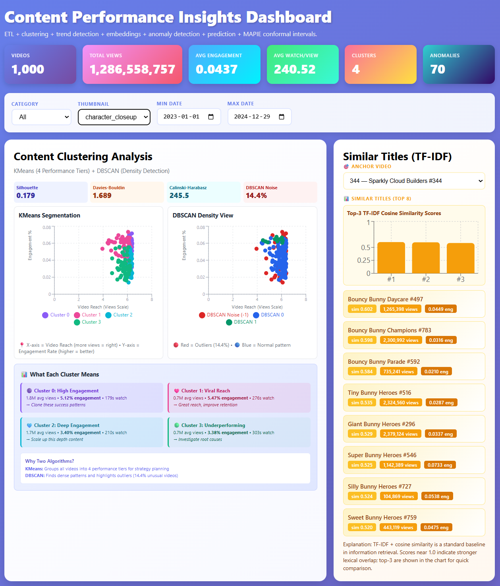
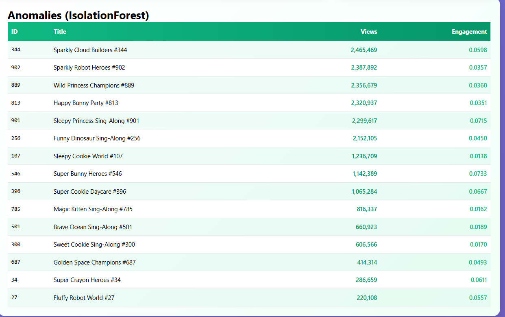
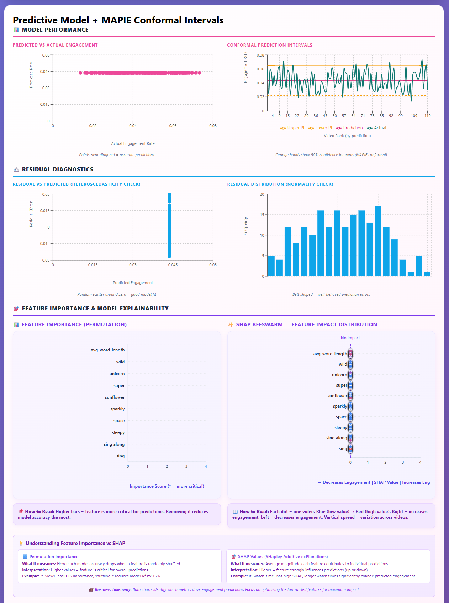
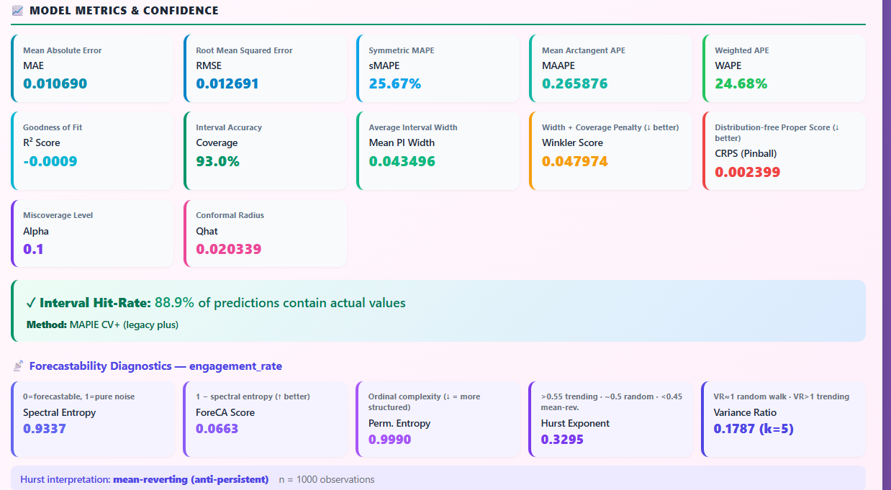
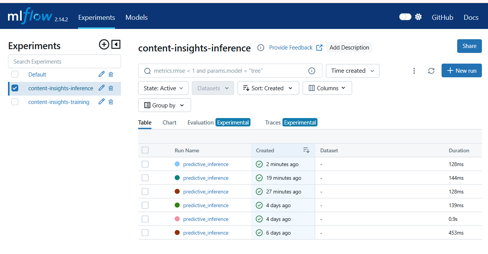
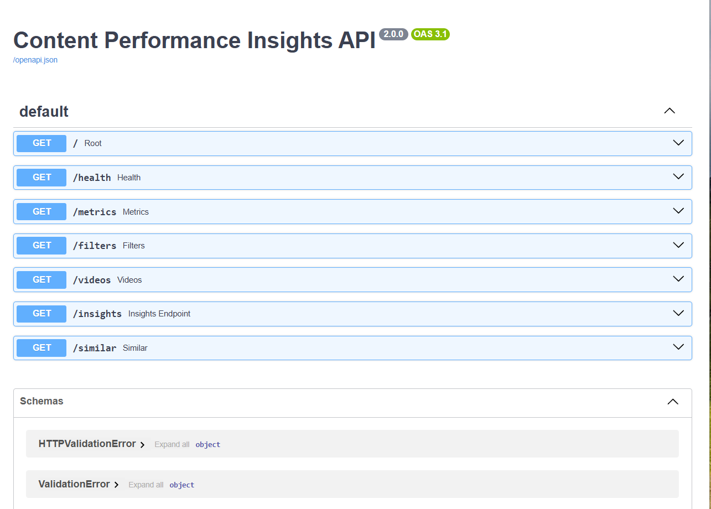

# Content Performance Insights Dashboard - by Candidate

## Setup

### Option 1: Run with Docker

Requirements:
- Docker + Docker Compose

Commands:
- docker compose up --build -d
- open http://localhost:5173
- backend health: http://localhost:8000/health
- docker compose down -v

## Dashboard Screenshots

<table>
  <tr>
    <td width="50%">
      
      
<strong>Clustering Overview</strong> KMeans/DBSCAN cluster segmentation and feature relationships.

    </td>
    <td width="50%">
      
      
<strong>Anomaly Detection</strong> Outlier rows for fast root-cause review.

    </td>
  </tr>
  <tr>
    <td width="50%">
      
      
<strong>Predictive Benchmark Mode</strong> Model vs leakage-safe naive baseline with acceptance status.

    </td>
    <td width="50%">
      
      
<strong>Forecastability Metrics</strong> Coverage, interval quality, and low-signal transparency.

    </td>
  </tr>
  <tr>
    <td width="50%">
      
      
<strong>MLflow Tracking</strong> Experiment comparison and artifact traceability.

    </td>
    <td width="50%">
      
      
<strong>API Documentation</strong> Interactive endpoint testing from Swagger UI.

    </td>
  </tr>
</table>

### Option 2: Run with local venv + npm

Requirements:
- Python 3.12
- Node.js 20+

Backend:
- ./setup_venv.sh
- source .venv/bin/activate
- pip install -r requirements.txt
- pip install -e backend/
- export APP_DATA_PATH=./sample_videos.csv
- cd backend && uvicorn app.main:app --reload --port 8000

Frontend (new terminal):
- cd frontend
- npm install
- npm run dev
- open http://localhost:5173

## Approach

This project follows the assignment structure:

### Part 1: Data Processing
- CSV ingestion and validation in backend/app/etl.py
- Type coercion and missing/invalid row filtering
- Derived metrics:
  - engagement_rate = (likes + comments + shares) / views
  - avg_watch_time_per_view = watch_time_seconds / views

### Part 2: Insights and Analysis
Implemented more than two analysis tracks:
- Clustering: backend/app/analysis_clustering.py
- Trend detection: backend/app/analysis_trends.py
- Embeddings similarity: backend/app/analysis_embeddings.py
- Anomaly detection: backend/app/analysis_anomaly.py
- Predictive model with uncertainty: backend/app/analysis_predictive.py

Predictive modeling is intentionally leakage-safe:
- Target: engagement_rate
- Input features: pre-publication only (title text/style features, category, thumbnail_style, publish-date derived features)
- No post-publication engagement metrics are used as model features
- Temporal + video_id-safe split in notebook workflow

Predictive outputs are benchmark-aware:
- API returns model metrics and leakage-safe naive baseline metrics
- Dashboard shows model vs naive MAE uplift and acceptance status
- If model cannot beat naive baseline with stable coverage, status is marked as low-forecastability

Important scope decision:
- 24h -> 48h window forecasting is not implemented for current dataset because true windowed telemetry columns do not exist in sample_videos.csv.
- It is documented as future work only.

### Part 3: Visualization
React dashboard (frontend/src/App.tsx) includes:
- Overview metrics
- Clustering visualization
- Anomaly view
- Predictive metrics and uncertainty outputs
- Similar content panel (TF-IDF cosine similarity)
- Interactive filtering

## Key Insights

- The dataset supports strong descriptive analytics (clusters, anomalies, similarity).
- Leakage-free pre-publication predictive signal is weak for final engagement_rate, so holdout R2 is near zero/slightly negative.
- This is expected and honest after removing target-derived leakage features.
- Prediction intervals and baseline comparison are more informative than point R2 alone for this scope.

## Forecasting Scope

- Current dataset is suitable for:
  - Descriptive analytics and segmentation
  - Anomaly detection
  - Similar-title retrieval
  - Uncertainty-aware baseline forecasting
- Current dataset is not sufficient for strong pre-publication engagement forecasting.
- For next-window forecasting, use the telemetry schema in `docs/FORECASTING_V3_SCHEMA.md`.

## Technical Decisions

- FastAPI backend for simple, typed analytics APIs.
- React + TypeScript + Vite for fast interactive dashboard iteration.
- scikit-learn ecosystem for clustering/anomaly/predictive pipelines.
- MAPIE conformal intervals for uncertainty-aware outputs.
- Notebook kept as reproducible analysis surface for model diagnostics.

## Given More Time

- Collect real event-level or windowed telemetry for true next-window forecasting.
- Add creator/channel context and richer content metadata.
- Add ablation reports and drift monitoring dashboards.
- Improve production observability and regression tests around leakage constraints.

## Repository Structure

- backend/: API + ETL + analytics modules
- frontend/: React dashboard
- notebooks/: exploratory and validation notebook
- models/: saved artifacts
- docs/: supporting notes
- sample_videos.csv: source dataset

## Notes for Reviewers

- The deliverable prioritizes correctness, leakage safety, and explainability over chasing high predictive R2 from target leakage.
- All major requirements in Part 1, Part 2, and Part 3 are implemented and runnable locally.
